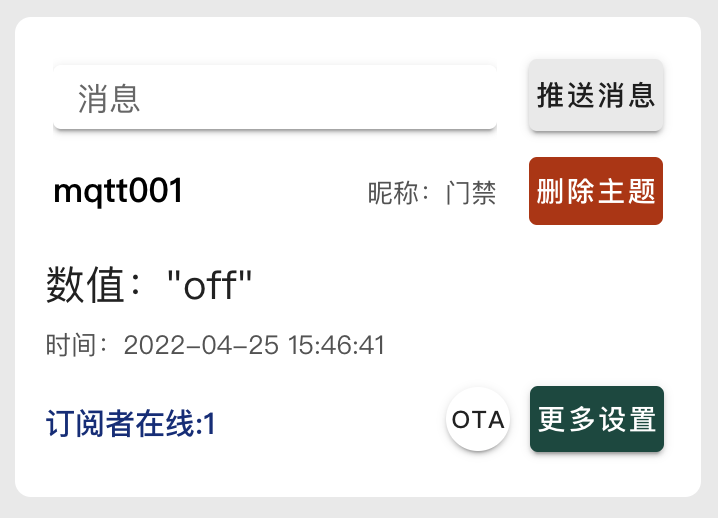
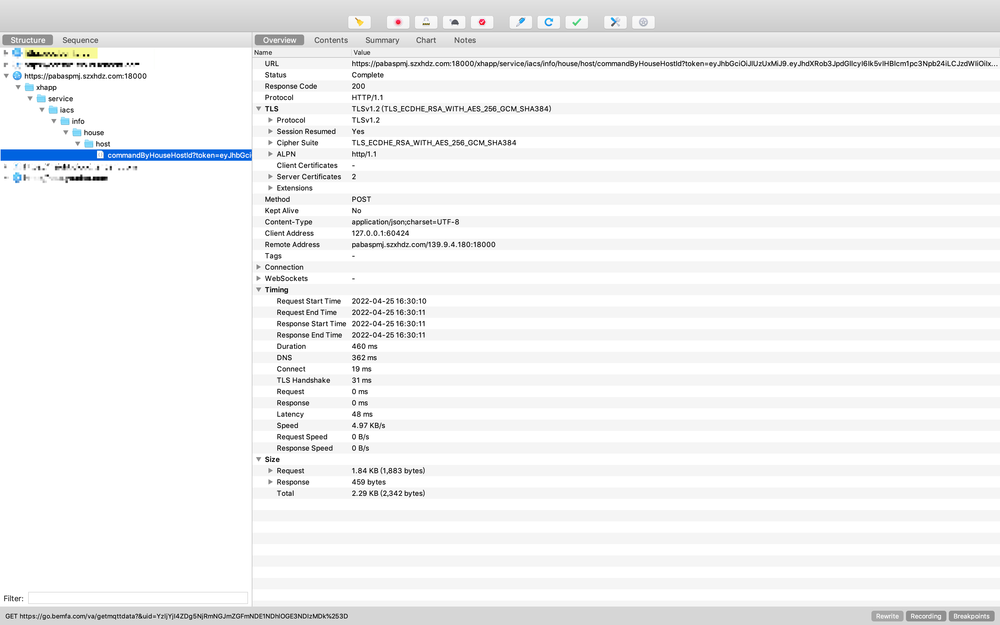
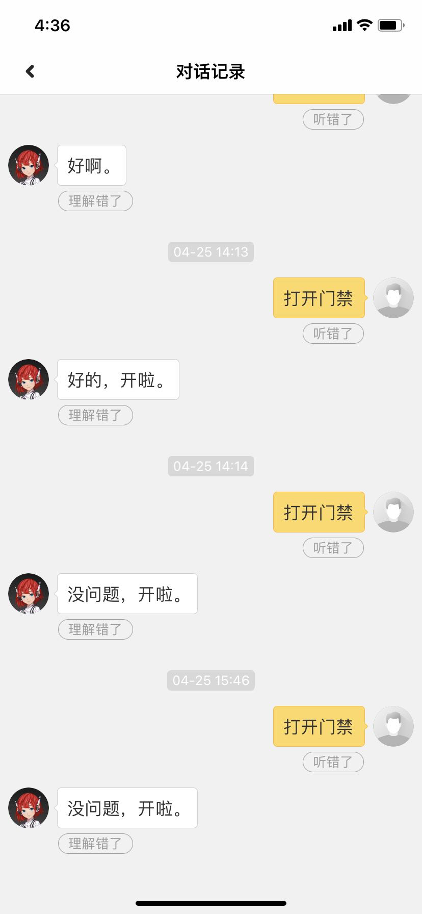

## 1、背景

当你正在团战的时候，外卖/快递小哥让你给开门，你是不是很烦~开吧，就抛弃了你的四个队友，不开吧，耽误了外卖小哥的时间~这个时候，如果你能喊一声小爱同学，打开门禁，门就开了，是不是就都不耽误了~

正好家里有个小爱，拿来玩一下~

## 2、实现原理

给小爱发出指令 -> 通知第三方服务（巴法）-> 通知我们后端服务 -> 调用楼下门禁开门接口

### 2.1 建立小爱和巴法的关联

注册巴法，https://cloud.bemfa.com/

新建MQTT 设备云

新建主题，比如mqtt001

进入主题详情，设置设备名称，比如我们就叫做 门禁

打开米家APP -> 我的 -> 其他平台设备 -> 添加 -> 绑定你的巴法账号 -> 同步设备

关联完成。此时你对小爱说，打开门禁，他如果说设备不在线，就是合理的。

### 2.2 搭建mqtt，订阅小爱的消息

我们新建一个springboot项目，为什么呢？因为后面我们计划提供接口出来给app或者小程序调用。当然，你直接新建一个java/kotlin项目也是完全ok的。完整代码在最后，不要着急~

**添加mqtt依赖**

```xml
<!-- MQTT -->
<dependency>
  <groupId>org.springframework.integration</groupId>
  <artifactId>spring-integration-mqtt</artifactId>
</dependency>
```

**初始化mqtt客户端**

这里clientid填写你在巴法中申请私钥

```java
public class MqttFactory {

    private static MqttClient client;

    /**
     *   获取客户端实例
     *   单例模式, 存在则返回, 不存在则初始化
     */
    public static MqttClient getInstance() {
        if (client == null) {
            init();
        }
        return client;
    }

    /**
     *   初始化客户端
     */
    public static void init() {
        try {
            client = new MqttClient("tcp://bemfa.com:9501", "xxx");
            // MQTT配置对象
            MqttConnectOptions options = new MqttConnectOptions();
            // 设置自动重连, 其它具体参数可以查看MqttConnectOptions
            options.setAutomaticReconnect(true);
            if (!client.isConnected()) {
                client.connect(options);
            }
        } catch (MqttException e) {
            LOGGER.error(String.format("MQTT: 连接消息服务器[%s]失败", "bemfa.com:9501"));
        }
    }
}
```

**订阅主题**

```java
MqttClient client = MqttFactory.getInstance();
try {    
  client.subscribe(topic, new MessageListener());  
} catch (MqttException e) {    
  LOGGER.error(String.format("MQTT: 订阅主题[%s]失败", topic));  
}
```

**验证订阅**

将代码跑起来，查看巴法控制台，如果订阅者在线数变成了1，那么说明整条链路通了。



此时，你对小爱说，打开门禁，它应该会说打开了之类的话。当然我的小爱比较皮，说了句 “小事儿”。

于此同时，你也会收到订阅消息，内容是 “on”，剩下的就是在收到“on”时处理开门逻辑了。

### 2.3 抓取打开门禁接口

我用的是平安门禁，然后打开Charles，手机上打开平安门禁小程序，点击开门，抓出链接，一气呵成。



可以看到，请求是post，链接就是url那一坨。Content-Type是json，另外还需要传json数据验证身份。

```json
{
	"houseHostId": "xxx",
	"peopleId": "xxx",
	"roleType": "0"
}
```

你也不用管这些数据有啥用，拿到这些数据调用接口就完事了。

## 3、实战效果

一切搞定，叫老婆去楼下门禁那儿等着，我操作一波。

### 3.1 唤醒小爱，对他说 打开门禁，他说 “没问题，开啦”

### 3.2 查看小米音箱的聊天记录



### 3.3 确实说了，然后查看钉钉日志。


### 3.4 老婆打电话过来说，门已经开了，大功告成。

## 4、参考资料

其实这是我一个朋友做的，只不过是他用go语言实现的，他也在自用，思路来源于他，我只不过自己弄了个可以用的版本，觉得好玩，写个博客玩一下。

他的Go语言源码：https://github.com/unliar/miai-actions

我的Java版本源码：https://github.com/MZCretin/open-door

## 5、多想点~

能用小爱打开门禁，是不是也能打开更多东西了，比如xxxxxxx